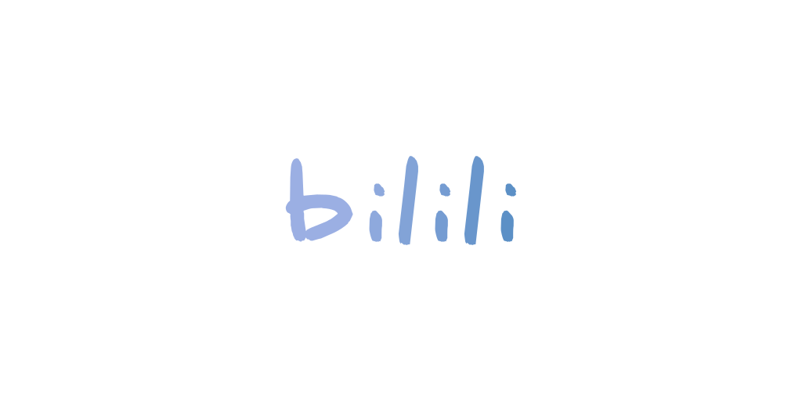

# 𝓫𝓲𝓵𝓲𝓵𝓲

<p align="center">
   
</p>

<p align="center">
   <a href="https://bilibili.com" target="_blank"></a>
   <a href="https://python.org/" target="_blank"></a>
   <a href="https://pypi.org/project/bilili/" target="_blank"></a>
   <a href="https://pypi.org/project/bilili/" target="_blank"></a>
   <a href="https://github.com/SigureMo/bilili/actions?query=workflow%3A%22API+Test%22" target="_blank"></a>
   <a href="LICENSE"></a>
   <a href="https://gitmoji.carloscuesta.me"></a>
</p>

<p align="center"><strong>🍻 𝓫𝓲𝓵𝓲𝓵𝓲，可以帮你快速下载 <a href="https://www.bilibili.com">B 站</a>投稿视频以及番剧视频的 CLI～～～</strong></p>

**全新文档请访问 <https://bilili.sigure.xyz>**

## 特性

-  支持 ACG 视频（也即原 AV 号视频）和番剧下载
-  多线程 + 分块下载，轻松跑满你的带宽
-  断点续传，即便一次没下完也可以接着下载
-  弹幕支持，自动下载弹幕并转换为 ass 弹幕，本地播放器也可以体验 B 站的看视频体验
-  全清晰度支持，本地可以看任意在线看到的清晰度，而且本地播放不受限于带宽

## 快速开始

`bilili` 可以从以下两种视频主页获取视频

-  投稿视频主页：
   -  `https://www.bilibili.com/video/avxxxxxx`
   -  `https://b23.tv/avxxxxxx`
   -  `https://www.bilibili.com/video/BVxxxxxx`
   -  `https://b23.tv/BVxxxxxx`
-  番剧视频主页：
   -  `https://www.bilibili.com/bangumi/media/mdxxxxxx`
   -  `https://www.bilibili.com/bangumi/play/ssxxxxxx`
   -  `https://b23.tv/ssxxxxxx`
   -  `https://www.bilibili.com/bangumi/play/epxxxxxx`
   -  `https://b23.tv/epxxxxxx`

### 安装 FFmpeg

由于大多数格式需要合并，所以 bilili 依赖于 FFmpeg，你需要事先安装好它

Windows 请[手动下载](https://ffmpeg.org/download.html)后，存放到任意目录下，并将 `ffmpeg.exe` 所在目录**添加到环境变量**

而如果是 `*nix`，可以很方便地通过包管理器一键完成

你可以通过直接在终端运行 `ffmpeg -version` 测试是否安装成功

### 安装 Bilili

#### pip 安装

现在 bilili 支持通过 pip 一键安装

```bash
pip install bilili
```

#### 源码安装

此外你还可以从 GitHub 上下载最新的源码进行安装

```bash
git clone git@github.com:SigureMo/bilili.git
cd bilili/
python setup.py build
python setup.py install
```

### 运行

运行非常简单～

```bash
bilili <url>
```

当然，你需要将 `<url>` 替换为前面的视频主页 url

## 参数

`bilili` 还支持很多参数，但参数使用方法等内容此处不作赘述，详情请访问[文档](https://bilili.sigure.xyz/cli/)

-  `-t`/`--type` 选择下载类型（`flv` or `dash` or `mp4`），默认为 dash 类型，注意该参数仅代表下载源格式，所有格式最后均会转为 mp4
-  `-d`/`--dir` 指定存储目录，默认为项目根目录
-  `-q`/`--quality` 指定清晰度，默认为 `120`（4K）
-  `-n`/`--num-threads` 指定最大下载线程数，默认为 16
-  `-p`/`--episodes` 选集，默认为 `^~$`（全选）
-  `-w`/`--overwrite` 强制覆盖已下载视频
-  `-c`/`--sess-data` 传入 `cookies` 中的 `SESSDATA`
-  `-y`/`--yes` 跳过下载询问
-  `--audio-quality` 指定音频质量等级，默认为 `30280`（320kbps）
-  `--playlist-type` 指定播放列表类型，支持 `dpl` 和 `m3u` ，默认为 `dpl`，设置为 `no` 即不生成播放列表
-  `--danmaku` 指定弹幕类型，支持 `xml` 和 `ass`，如果设置为 `no` 则不下载弹幕，默认为 `xml` 弹幕
-  `--block-size` 分块下载器的块大小，单位为 MB，默认为 128MB，设置为 0 时禁用分块下载
-  `--abs-path` 修改播放列表路径类型为绝对路径
-  `--use-mirrors` 启用从多个镜像下载功能 「Beta」
-  `--disable-proxy` 禁用系统代理 「Beta」
-  `--debug` 开启 `debug` 模式

## 参与贡献

请阅读 [CONTRIBUTING.md](CONTRIBUTING.md)
